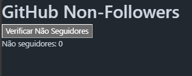

<p align="left"></p>

# 🕵️‍♂️ Who don´t follow you back in Github


- ## **📌 Resumo do projeto** 

Who don´t follow you back in Github é um codigo que permite ver quem não segue você de volta no Github. Não requer downloads ou instalações.


- ## **🎯 Objetivo**

Criação de uma lista com usuários que não te segue nessa rede.


- ## **👥 Equipe**

Projeto de Thaise Oliveira. Com base no repositório do @herbertcarnaubadesouza de descobrir não seguidores no Instagram https://github.com/herbertcarnaubadesouza/who-dont-follows-u


- ## **👩‍💻Como usar:** 
1. Copie o codigo abaixo
```java
"use strict";

const GITHUB_API_URL = "https://api.github.com/users/";
let nonFollowersList = [],
    followingList = [],
    isActiveProcess = false;

function sleep(ms) {
    return new Promise((resolve) => setTimeout(resolve, ms));
}

async function getFollowers(username) {
    const response = await fetch(`${GITHUB_API_URL}${username}/followers`);
    if (!response.ok) {
        throw new Error('Error fetching followers: ' + response.statusText);
    }
    return await response.json();
}

async function getFollowing(username) {
    const response = await fetch(`${GITHUB_API_URL}${username}/following`);
    if (!response.ok) {
        throw new Error('Error fetching following: ' + response.statusText);
    }
    return await response.json();
}

async function findNonFollowers(username) {
    if (isActiveProcess) return;
    isActiveProcess = true;
    showLoading(true);
    document.querySelector('.error-message').innerText = '';  // Alterado de doc para document

    try {
        const followers = await getFollowers(username);
        const following = await getFollowing(username);
        
        const followerSet = new Set(followers.map(user => user.login));
        nonFollowersList = following.map(user => user.login).filter(user => !followerSet.has(user));

        renderResults(nonFollowersList);
    } catch (error) {
        console.error(error);
        showError(error.message);
    } finally {
        isActiveProcess = false;
        showLoading(false);
    }
}


function renderResults(nonFollowers) {
    const resultsContainer = document.querySelector(".results-container");
    resultsContainer.innerHTML = ""; // Limpa resultados anteriores

    if (nonFollowers.length === 0) {
        resultsContainer.innerHTML = "<div>Ninguém não segue você de volta.</div>";
    } else {
        nonFollowers.forEach(user => {
            resultsContainer.innerHTML += `<div>${user}</div>`;
        });
    }
    document.querySelector(".nonfollower-count").textContent = `Não seguidores: ${nonFollowers.length}`;
}

function showLoading(isLoading) {
    const loader = document.querySelector(".loader");
    loader.style.display = isLoading ? "block" : "none";
}

function showError(message) {
    document.querySelector('.error-message').innerText = message;
}

function renderOverlay(username) {
    document.body.innerHTML = `
        <main>
            <div>
                <header>
                    <h1>GitHub Non-Followers</h1>
                    <button id="check-followers-btn">Verificar Não Seguidores</button>
                </header>
                <div class="loader" style="display:none;">Carregando...</div>
                <div class="error-message" style="color:red"></div>
                <div class="results-container"></div>
                <footer>
                    <div class="nonfollower-count">Não seguidores: 0</div>
                </footer>
            </div>
        </main>
    `;

    // Adicionando o listener de evento aqui
    document.getElementById('check-followers-btn').addEventListener('click', () => {
        findNonFollowers(username);
    });
}


function init() {
    const username = prompt("Digite seu nome de usuário do GitHub:");
    if (username) {
        renderOverlay(username);
    } else {
        alert("O nome de usuário é obrigatório!");
    }
}

init();
```
2. Faça login em sua conta e abra o console do desenvolvedor ou (Ctrl+Shift+J(Windows) || ⌘+⌥+I (Mac os)) e cole o código. Ele pedirá seu nome de usuário:
  
    
  
3. Após colocar seu nome de usuário você encontrará a seguinte interface:
  
   
  
4. Clique no botão 'Verificar não Seguidores', os usuários que não seguem de volta serão listados. 
ps: Se desejar deixar de seguir algum usuário será necessário copiar o username, inserir no final da URL https://github.com/ e clicar em unfollow.

## **🙋‍♀️ Responsabilidade de uso é inteiramente do usuário**: Esse código não é afiliado, associado, autorizado, endossado ou de qualquer forma oficialmente conectado ao Github.
  
